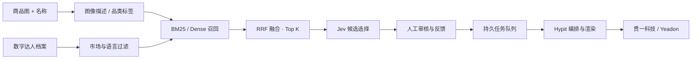

<div align="center">

# Creator Network
### 让商品，找到它的数字表达者。

**Jev × Hypit · 开源商品与数字达人匹配工作台**

[](https://github.com/Yeadon8888/jev-hypit-commerce/actions/workflows/check.yml)


[](LICENSE)

[快速开始](#快速开始) · [系统架构](docs/architecture/README.md) · [选型研究](docs/research/retrieval-ranking.md) · [视频工程](productions/original-ugc/README.md) · [路线图](ROADMAP.md)

</div>

从一张商品图和商品描述出发，召回合适的数字达人，记录 Jev 的候选决策，经过人工审核，再由 Hypit 输出品牌视频。我们正在构建一个 **AI Agent 原生数字达人网络**；当前开源的是它的匹配与内容交付基础设施。

**v0.4 提供可运行的工作台、REST API、持久化任务、审核记录、可选向量检索及可复现视频工程。** 它是单工作空间的模块化应用，尚未实现多租户、自动经营账号或自主商业合作。

[](productions/original-ugc/videos/guanyi-original-ugc.mp4)

**当前主版本：26 秒原音乐复刻节奏 + UGC。** 保留商品与人物逐格填入，在填满后的原切点插入三栏 UGC，然后回到原矩阵扩张和 GitHub 片尾。
[贯一科技版](productions/original-ugc/videos/guanyi-original-ugc.mp4) · [Yeadon 版](productions/original-ugc/videos/yeadon-original-ugc.mp4) · [Hypit 工程](productions/original-ugc/README.md)

[无 UGC 的原版](productions/hd-fast/README.md) 与 [30 秒试验版](productions/matrix-ugc/README.md) 保留归档。

## 不止一段展示视频

| 模块 | 当前可运行的能力 |
|---|---|
| **Workbench** | 商品 / 达人库、搜索、JSON 导入、候选卡片、人工选择、审核、任务记录、双版本交付 |
| **Retrieval** | 市场 / 语言 / 启用状态过滤；BM25 基线；可选 FastEmbed + Qdrant 向量召回和 RRF 融合 |
| **Decision** | Jev `choice` 从候选集合选择一个达人；校验返回 ID 与置信度；失败明确报错 |
| **Review** | 保留匹配时的商品与候选快照；支持人工改选 / 拒绝；审核通过才能创建视频任务 |
| **Jobs** | SQLite WAL 持久队列、事务领取、租约心跳、幂等提交、事件记录、显式重试 |
| **Production** | Hypit 可编辑时间线、素材帧采样、音轨合成、贯一科技 / Yeadon 双水印导出 |
| **Evaluation** | 小型人工标注检索回归集、Precision@1 / Recall@3 / MRR；不宣称商业转化提升 |



图像理解可通过原有 `analyze.py` 调用 TokensFactory；工作台接受整理好的描述和标签。向量适配器当前嵌入**文字描述**，不把图片路径当成视觉特征。演示人物的专业方向来自编辑设定，不能从人脸推断。

## 快速开始

Python 3.11+。先运行匹配工作台，无需 Node、浏览器渲染环境或模型密钥：

```sh
git clone https://github.com/Yeadon8888/jev-hypit-commerce.git
cd jev-hypit-commerce
python3 -m venv .venv
source .venv/bin/activate
pip install -e '.[test]'
creator-network seed
creator-network serve
```

打开 **http://127.0.0.1:8890**。默认导入 3 件原创虚构商品及 3 位插画达人；选择商品 → 开始匹配 → 审核。选择 `BM25` 可完全本地运行。希望查看影片中的高清数据时：

```sh
creator-network seed --showcase
```

展示集增加 99 件商品和 100 个合成人物档案；重复导入更新同 ID，不清空现有库。展示图的权利范围见 [媒体说明](productions/hd-fast/MEDIA-NOTICE.md)。同类人物的不同内容风格是编辑设定，不代表经过验证的人格或表现。

### 启用 Jev

在启动服务的终端设置 `JEV_API_KEY`（建议使用密钥管理器或无回显输入），重启服务即可在界面选择 Jev。密钥只保留在服务进程环境，不写入任务、前端或 Git。

Jev 负责候选中的 **单个最优选择**；它不是这里的向量库，也不是快速排序算法。其余候选保留召回顺序，BM25 / RRF 分数与 Jev 置信度分别展示。无密钥或调用失败时，不伪装成 Jev 结果。

### 启用混合检索

```sh
pip install -e '.[semantic]'
CREATOR_RETRIEVAL=hybrid creator-network serve
```

首次使用会下载 `BAAI/bge-small-en-v1.5` 模型。默认使用本地 Qdrant 存储；多个进程需使用外部 Qdrant，并通过 `QDRANT_URL` 指定。默认 BGE small 英文模型适合本示例的美国市场英文描述；中文语义检索需另行评估模型。

### 审核后导出视频

另需 Node.js 22+、FFmpeg / FFprobe、Chrome 或 Chromium：

```sh
npm ci
npm run setup
npm run build
```

回到工作台，审核后点击「生成双水印视频」。任务完成后在「视频交付」下载两个版本。此流程生成审核配对的 **15 秒展示视频**；不会自动提交新的付费 UGC 生成任务。当前主片恢复原来的音乐和剪辑节奏：

```sh
npm run video:original-ugc
```

完整操作、配置、API 示例与容器说明见 [运行手册](docs/guides/operations.md)。原有批量 CLI 保留，见 [CLI 指南](docs/guides/legacy-cli.md)。

## 工程结构

```text
apps/workbench/            中文交互工作台
src/creator_network/      API、召回、Jev、审核、任务、渲染适配器
packages/                 可复用 Hypit 场景组件
productions/matrix-ugc/    30 秒矩阵 + UGC 试验归档
productions/advanced/      4 条 UGC、提示词、原始生成记录
productions/hd-fast/       原高清商品、图集、音乐与矩阵工程
productions/original-ugc/  当前 26 秒原节奏 + UGC 双水印主片
examples/                 原创插画及虚构商品，无密钥样例
evals/                    小型检索回归集及结果
tests/                    API / 状态机 / 供应商契约 / 渲染准备测试
deploy/                   容器与可选 Qdrant 部署
docs/                     架构、研究、使用与验证记录
```

## 验证与演进

```sh
pytest -q
creator-network evaluate
npm ci && npm run build
```

[验证记录](docs/VALIDATION.md) 区分本地真实调用、模拟契约测试和仍未验证的环境。小型回归集上的高分不能代表真实商品匹配质量；商用前需要自己的人工相关性标注、拒绝样本和线上反馈评估。

参考了 [Qdrant](https://github.com/qdrant/qdrant)、[FastEmbed](https://github.com/qdrant/fastembed)、[Gorse](https://github.com/gorse-io/gorse) 的召回与服务分层思路；实际依赖及未采用部分见 [选型记录](docs/research/retrieval-ranking.md)。这些项目没有为本项目背书。

代码和原创插画采用 [MIT](LICENSE)。商品图、生成媒体和第三方模型各自适用其权利及许可条件，见各 production 的媒体说明。欢迎按 [贡献指南](CONTRIBUTING.md) 提交改进。
