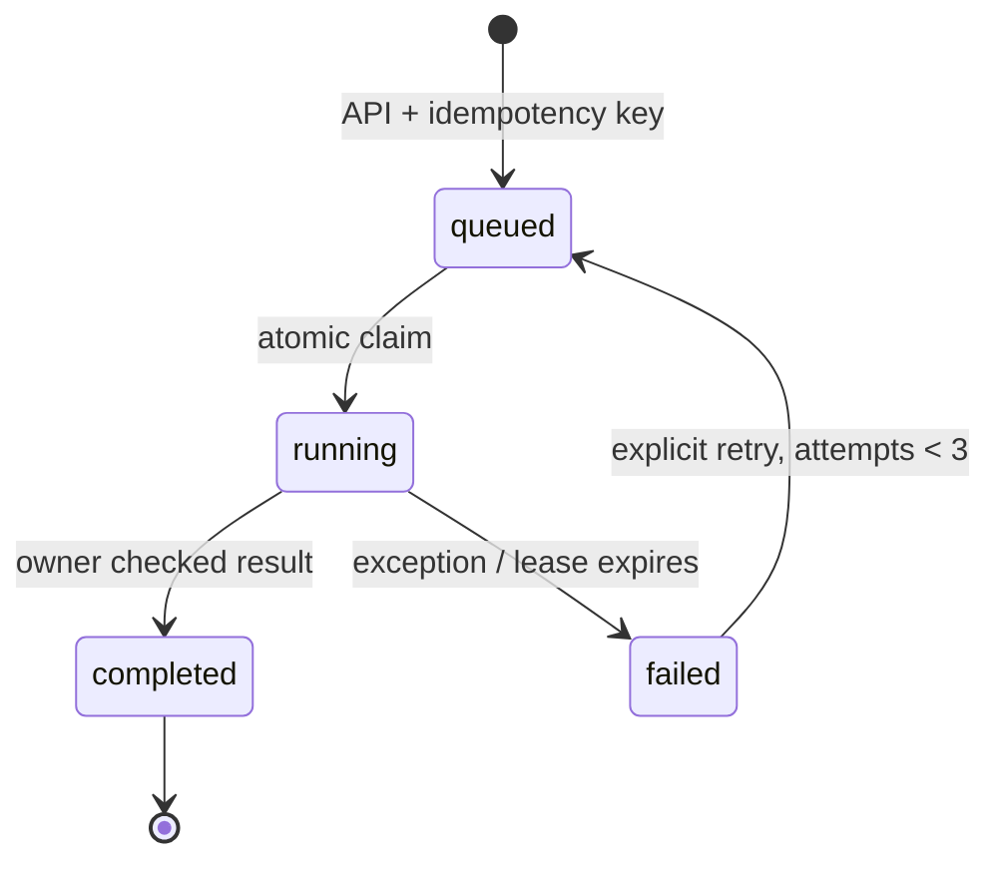

# Architecture · v0.4

选择模块化单体 + 持久任务队列，先建立明确边界与真实运行路径。当前 100 级候选量不需要人为拆成十几个微服务。API 与 worker 已可以分进程运行，后续可在接口稳定后替换队列和存储。

## 数据与执行路径

1. **Catalog**：Pydantic 校验 ID、类型、标签与字段长度；SQLite 保存商品 / 达人。导入整批事务提交，冲突回滚。图像作为本地受限媒体引用，描述来自人工或 `analyze.py`。
2. **Retrieval**：只检索 active 且 market / language 匹配的达人；BM25 使用名称、描述、标签。可选 BGE small + Qdrant 给出 dense 排名，以 `1/(60+rank)` 做 RRF 融合。
3. **Decision**：Jev `jev-latest`、`state`、`questions.creator.type=choice`，候选 ID 是合法枚举。响应必须包含已有 ID 和 0–1 有限置信度。供应商错误不降级成假成功。
4. **Review**：结果包含商品 / 候选快照、决策来源、时间与审核状态。人工可在本次候选中改选。所有视频任务必须获得审核，即使置信度达到阈值。
5. **Production**：审核快照 → storyboard → Hypit → 两种透明水印。任务快照固定提交当时的审核；后续审核改变不会追溯撤回已创建的视频任务。

## 作业状态机

任务 ID 与业务输入分离。幂等键对应 canonical payload 的 SHA-256，同键不同输入返回 409。`BEGIN IMMEDIATE` 保证同一任务只有一个 worker 领取。90 秒租约，每 20 秒心跳；过期任务标记失败，避免不知情重复收费。重试必须显式触发，最多三次。

**限制**：这不是外部供应商 exactly-once 交付。进程崩溃时远端调用可能已经发生；重新提交可能重复计费。当前取消任务、定时调度、分布式限速、RBAC、多租户和反馈训练尚未实现。

## 存储

| 表 / 目录 | 责任 |
|---|---|
| items | 商品、达人配置 JSON 与类型索引 |
| jobs | 请求、状态、租约、次数、结果、幂等摘要 |
| events | 状态转移与审核轨迹 |
| feedback | 人工批准 / 拒绝及备注 |
| data/jobs/{id} | storyboard、Hypit 工程、日志、两个视频 |
| data/qdrant | 可选本地向量存储 |

SQLite WAL 适用于单机器工作空间。API 多进程与远程 worker 不是当前推荐模式；扩容需 PostgreSQL、对象存储、专用队列与 tenant 隔离迁移。Qdrant 本地客户端只能由一个进程持有，分进程时使用远程 Qdrant。

## 扩展点

- `MatchingPipeline` 接收 `selector` 与 `semantic`，可替换检索和决策适配器。
- `JevSelector` 将供应商结构和错误与 API 隔离。
- `rendering.py` 只消费批准后的不可变任务输入；另增 UGC provider 应使用独立任务类型、预算与供应商幂等机制。
- 当前尚无 learned reranker；Jev 只作 top-1 choice。未来 pairwise / listwise 排序需要新增契约与评估，不能简单改名冒充。
