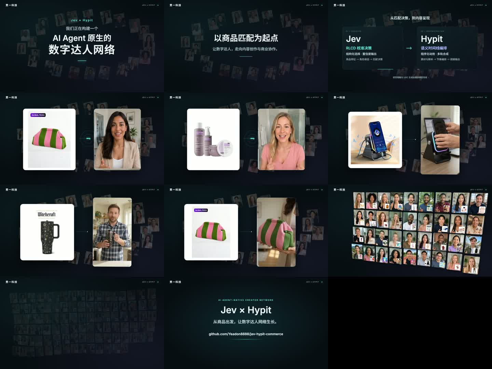

# Jev × Hypit · AI Agent 原生数字达人网络

进阶版的完整 Hypit 工程：42 秒横版主片、4 条独立竖屏 UGC、原始提示词、角色参考、原创电子配乐与重新导出脚本。

主片从「我们正在构建一个 AI Agent 原生的数字达人网络」开始，以商品匹配引出 Jev 结构化决策和 Hypit 语义时间线编排，再展示商品与达人对应、UGC 和空间矩阵扩张。

## 观看

- [贯一科技 · 42 秒主片](videos/advanced-guanyi.mp4)
- [香水 UGC](assets/ugc/perfume.mp4)
- [桌面音箱支架 UGC](assets/ugc/speaker.mp4)
- [随行杯 UGC](assets/ugc/tumbler.mp4)
- [条纹包 UGC](assets/ugc/bag.mp4)



## 重现已完成影片

在仓库根目录：

```sh
npm ci
npm run setup
npm run video:advanced
```

导出：`output/advanced/advanced-guanyi.mp4`。此流程只使用已保存媒体，不调用付费模型，不需要 API 密钥。FFmpeg 会先将竖屏片段规范为 30fps，再交给 Hypit 进行精确帧采样和多轨合成。

预览可编辑工程（先运行一次导出或素材准备）：

```sh
python3 -c "import runpy; runpy.run_path('productions/advanced/export.py')['prepare']()"
npm run build
npx hypit studio --run productions/advanced/runs/main.svrun
```

本版本复用 `../hd-fast/assets/` 中的高清商品与人物图集，克隆完整仓库即可满足依赖。

## 修改入口

- `authors/main.svml`：42 秒时间线、商品与视频素材、原创音乐与 UGC 声音片段。
- `../../packages/advanced-scene/src/render.ts`：主题、机制卡片、空间环绕、匹配、动态 UGC 窗口、12 / 36 / 99 节点矩阵、GitHub 片尾。
- `../../packages/advanced-scene/src/content.ts`：保存的商品与角色映射。
- `assets/references/`：从现有虚构人物图集中提取的四个角色。
- `assets/ugc/`：TokensFactory 生成视频与任务来源记录。
- `prompts/`：提交给视频模型的实际参数及英文 UGC 台词。
- `score.py`：42 秒、132 BPM 的原创合成器配乐；无需第三方采样。
- `BRIEF.md`、`RESEARCH.md`：创意、镜头表与技术表述依据。

需要重新生成 UGC 时，在环境变量设置 `TOKENSFACTORY_API_KEY`，或运行脚本后在隐藏输入提示中填写：

```sh
python3 productions/advanced/generate_ugc.py
```

它使用 `veo-omni-flash`，仅缺少视频时调用服务。已有任务保存在被 Git 忽略的 `output/advanced-generation/`，重跑会继续轮询原任务。新的生成可能产生服务费用。公共参考图片 URL 指向本仓库；替换参考时需要同步更新提示词或 URL。

重新合成原创配乐需 NumPy：`python3 -m pip install numpy`，然后 `python3 productions/advanced/score.py`。正常重现影片不需要 NumPy。

## 真实实现范围

Jev 决策、Hypit 编排、外部媒体生成分别承担不同职责。当前电影重放已保存配对，没有伪装成实时推理。账号独立人格、持续生活故事及自主商业协作是项目发展方向，未在此原型中实现。

UGC 为虚构成年人物的生成式展示。保留原商品图并排展示以便对照；生成画面中的细小商标文字、手部接触及局部形状可能存在偏差，不视为经过商家验收的实物拍摄。

素材许可范围见 [MEDIA-NOTICE.md](MEDIA-NOTICE.md)。

随行杯的独立 UGC 截至 6.5 秒，去掉生成的重复尾句。`assets/sources/tumbler.mp4` 保留原 10 秒生成源供主片画面采样；主片仅使用其中 1–4 秒口播，其余动态墙画面静音。
